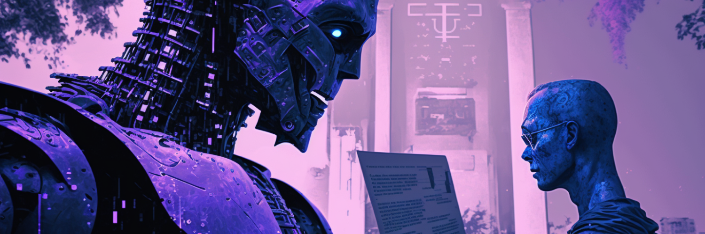

<h1 align="center">Hey there, меня зовут Кирилл</a>
</h1>
<h3 align="center">И я начинающий Data-Scientist</h3>

<h3 align="left">Sotf-skills:</h3>

**:1st_place_medal: Организаторские навыки и Лидерство:** Умею выступать в роли командного лидера, умение планировать, координировать и контролировать деятельность в проекте.  
**:moyai: Ответственность и Самостоятельность:** Готов взять на себя ответственность за результаты проекта, умение анализировать ситуацию, формировать и принимать решения без помощи других.  
**:two_men_holding_hands: Командная работа:** Умею эффективно сотрудничать с другими участниками проекта, кооперироваться и выстраивать взаимовыгодные отношения.

## 📌 Pinned Repositories

 

 

 

## &#x1f4c8; GitHub Stats

 

 
 

## 💼 Skills

More Skills

 

 
  

 

